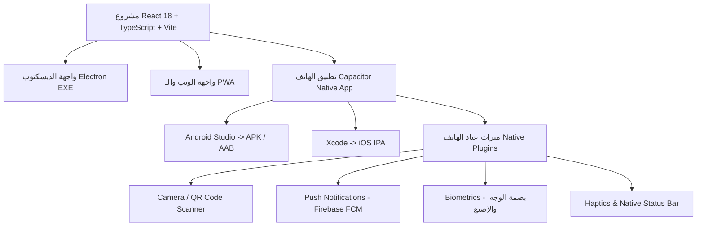

# الخطة المعمارية والتنفيذية الشاملة: تحويل مشروع إدارة المدرسة إلى تطبيق هاتف ذكي (Mobile App)

تهدف هذه الخطة إلى تحويل نظام إدارة المدرسة الحالي والمبني بـ (**React 18 + Vite + TypeScript + Supabase + Electron**) إلى **تطبيق هاتف أصلي (Native Mobile App)** بنظام **Single Codebase** موحد، بحيث يعمل نفس الكود على (الويب، الديسكتوب EXE، والأندرويد/iOS) بأعلى كفاءة وسلاسة.

---

## 1. الهيكل المعماري والتقني (Architecture & Technology Stack)



* **المحرك الأساسي للهاتف:** `Capacitor.js v6/v7` (أفضل وأسرع معيار للدمج مع Vite).
* **إدارة قواعد البيانات:** Supabase Client مع التخزين المحلي المؤقت (LocalStorage / IndexedDB / Capacitor SQLite) لضمان العمل Offline.
* **إدارة المظهر والأبعاد:** CSS Custom Variables + Safe Area Insets (`env(safe-area-inset-top)` & `env(safe-area-inset-bottom)`).

---

## 2. استراتيجية تكييف الواجهات وتجربة المستخدم (Mobile UI/UX System)

تتطلب تجربة الهاتف تحويل العناصر المكتبية إلى عناصر لمسية سلسة تلائم الاستخدام بيد واحدة (One-thumb Ergonomics):

### أ. نظام التنقل المحمول (Navigation & Shell)
1. **شريط التنقل السفلي (`MobileBottomNav`):**
   * يظهر فقط على الهواتف (`isMobile === true`).
   * يحتوي على **4 أو 5 ألسنة أساسية** حسب دور المستخدم:
     * **إدارة المدرسة:** الرئيسية | الحضور السريع | إدارة الطلاب | الإشعارات | المزيد (القائمة الجانبية).
     * **المعلم:** الرئيسية | حصصي | رصد الغياب | الواجبات | القائمة.
     * **ولي الأمر:** الرئيسية (بطاقات الأبناء) | الإشعارات | الرسائل والطلبات | الرسوم | القائمة.
2. **شريط العنوان العلوي المصغر (`MobileTopBar`):**
   * متكيف مع منطقة النوتش (Safe Area Top).
   * يحتوي على زر الرجوع الذكي `ArrowRight`، وشعار المدرسة المصغر، وزر الوضع الليلي، وقائمة المستخدم السريعة.
3. **قائمة "المزيد" السفلية (`MobileDrawer` / `BottomSheet`):**
   * للوصول إلى باقي صفحات النظام (مثل: التقويم، التعاميم، جدول الامتحانات، الكتب الرسمية) عبر شبكة من الأيقونات المربعة المنظمة بدلاً من القوائم الطويلة.

### ب. تحويل الجداول العريضة إلى بطاقات ذكية (`DataTables` ➔ `Swipeable Cards`)
* **قائمة الطلاب / المعلمين:**
  * تحويل كل صف في الجدول إلى **بطاقة طالب متجاوبة**:
    * صورة الطالب / الحرف الأول.
    * الاسم الثلاثي والصف والشعبة.
    * حالة الحضور اليوم (شارة خضراء/حمراء).
    * أزرار اتصال سريع بولي الأمر (اتصال هاتف أو واتساب مباشر بضغطة زر).
    * إيماءات السحب (Swipe Right لتحضير الطالب، Swipe Left لتسجيل غيابه).
* **كشف الحضور والغياب اليومي (`AttendanceSheet`):**
  * نمط **"التحضير السريع بالبطاقات"**: عرض صورة واسم الطالب مع زري (حاضر / غائب / متأخر) بحجم لمسي كبير (لا يقل عن 48x48 بكسل).

### ج. النوافذ المنبثقة والإدخال (Modals & Forms)
* استبدال الـ Desktop Modals بـ **Bottom Sheets (نوافذ تنزلق من أسفل الشاشة)** مع إمكانية إغلاقها بالسحب لأسفل.
* تكبير حقول الإدخال (`input` و `select`) لتناسب اللمس مع لوحة مفاتيح الهاتف الذكية (`type="tel"`, `type="email"`, `inputMode="numeric"`).

---

## 3. ميزات الهاتف المتقدمة (Native Capabilities Integration)

1. **الماسح الضوئي الذكي (QR Code Attendance Scanner):**
   * تشغيل كاميرا الهاتف لمسح الباركود/QR من بطاقات الطلاب عند بوابة المدرسة لتسجيل حضورهم فوراً في قاعدة بيانات Supabase.
2. **الإشعارات الفورية (Push Notifications):**
   * ربط Firebase Cloud Messaging (FCM) عبر `@capacitor/push-notifications` لإرسال إشعارات فورية لولي الأمر والمعلم حتى والتطبيق مغلق.
3. **الدخول بالبصمة (Biometric Authentication):**
   * تفعيل الدخول ببصمة الإصبع أو الوجه عبر `@capacitor-community/biometric-auth`.
4. **التغذية اللمسية وشريط الحالة (Haptics & StatusBar):**
   * اهتزاز خفيف (Light Haptic) عند الضغط على الأزرار أو حفظ البيانات لتأكيد نجاح العملية.
   * تلوين شريط بطارية الهاتف والأيقونات العلوية لتتماشى مع ألوان وثيم المدرسة.

---

## 4. خطة ومراحل التنفيذ التفصيلية (Implementation Phases)

### المرحلة 1: البنية التحتية لتكييف الواجهات (Frontend Mobile Adaptation)
* [MODIFY] `src/hooks/useDevice.ts`: بناء هوك لاكتشاف حجم الشاشة وبيئة التشغيل (Desktop/Web/Capacitor Native).
* [NEW] `src/components/layout/MobileBottomNav.tsx`: شريط التنقل السفلي المخصص حسب الأدوار.
* [NEW] `src/components/layout/MobileHeader.tsx`: الشريط العلوي المصغر والمتوافق مع النوتش.
* [NEW] `src/components/ui/BottomSheet.tsx`: مكون النوافذ السفلية المنبثقة.
* [MODIFY] `src/components/layout/Layout.tsx`: التبديل الديناميكي بين واجهة الهاتف والديسكتوب.
* [MODIFY] `src/index.css`: إضافة كلاسات الهواتف، وتحديد الـ Safe Area Variables، وضبط أحجام اللمس.

### المرحلة 2: تكييف الصفحات الحيوية (Key Pages Mobile Views)
* [MODIFY] `src/pages/attendance/AttendanceSheet.tsx`: إضافة وضع التحضير السلس للهاتف (Mobile Card Attendance).
* [MODIFY] `src/pages/students/StudentList.tsx`: دعم العرض الشبكي بالبطاقات للهاتف + الاتصال السريع.
* [MODIFY] `src/pages/Home.tsx`: ضبط شبكة البلاطات لتكون 2x2 أو 3x3 متناسقة مع شاشة الموبايل.

### المرحلة 3: تثبيت وتهيئة Capacitor (Capacitor Native Setup)
1. تثبيت حزم Capacitor الأساسية:
   ```bash
   npm install @capacitor/core @capacitor/cli @capacitor/android @capacitor/app @capacitor/haptics @capacitor/status-bar @capacitor/keyboard
   ```
2. إنشاء ملف إعدادات `capacitor.config.ts`:
   * تحديد الـ App ID (مثل: `iq.school.management`).
   * تحديد مجلد الويب `webDir: 'dist'`.
   * تفعيل خيارات العرض الكامل `viewport-fit=cover`.
3. إنشاء مشروع الأندرويد:
   ```bash
   npx cap add android
   ```

### المرحلة 4: ربط العتاد والأيقونات (Hardware & Assets)
* توليد وتثبيت أيقونات التطبيق (App Icons) وشاشة البداية (Splash Screen) لجميع مقاسات أندرويد.
* ضبط أذونات الـ `AndroidManifest.xml` (الإنترنت، الكاميرا، الإشعارات).

### المرحلة 5: الاختبار واستخراج ملف APK (Build & Delivery)
1. بناء ملفات الويب: `npm run build`
2. مزامنة الملفات إلى مجلد الأندرويد: `npx cap sync android`
3. فتح المشروع في أندرويد ستوديو أو توليد ملف APK مباشرة:
   ```bash
   cd android && ./gradlew assembleDebug
   ```
4. الحصول على ملف `app-debug.apk` جاهز للتثبيت والتجربة على أي هاتف أندرويد.

---

## 5. خطة التحقق والاختبار (Verification Plan)

### الاختبارات المحلية والتصميم:
* معاينة وضع الهاتف في المتصفح عبر أدوات المطور (Chrome DevTools Mobile Device Mode) على شاشات مختلفة (iPhone 14, Samsung Galaxy S23, iPad).
* التحقق من عمل جميع العمليات الحيوية (تسجيل الحضور، إرسال الواجبات، تصفح الإشعارات، تبديل الوضع الليلي) باللمس بالكامل.

### الاختبار الفعلي على الهاتف (Hardware Testing):
* تثبيت ملف الـ `APK` الناتج على جهاز هاتف أندرويد حقيقي وفحص:
  1. سرعة الفتح وسلاسة الحركة والرسوم.
  2. شريط التنقل السفلي والمسافات مع حواف الشاشة (Safe Areas).
  3. عمل المزامنة الفورية مع قاعدة بيانات Supabase.
